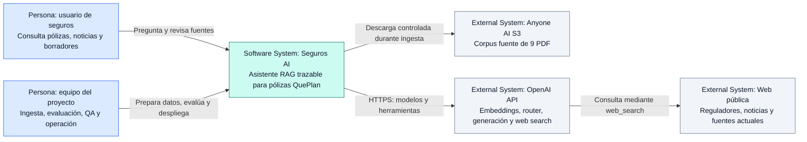
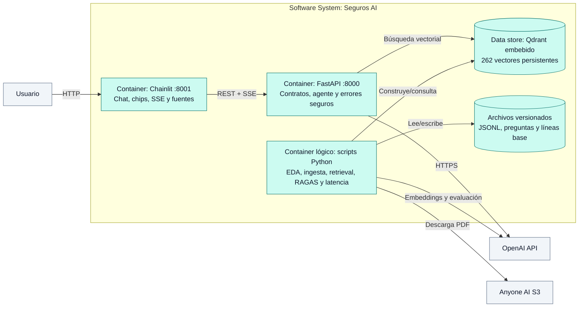
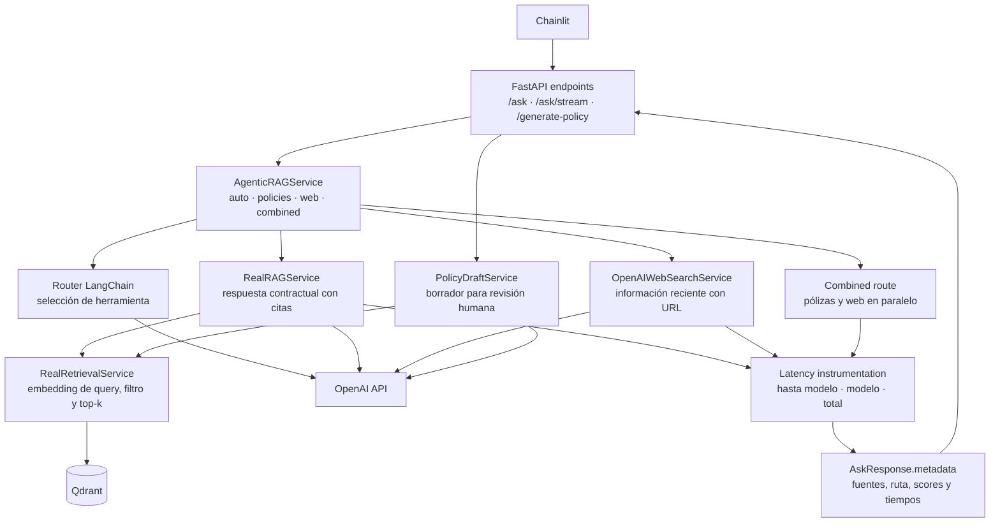

# Insurance Policy Generation Chatbot

Asistente agente para consultar pólizas QuePlan, combinar evidencia contractual
con información web reciente y generar borradores trazables para revisión humana.

## Estado técnico

- 9 PDF auditados: 267 páginas, 81.698 palabras y 0 fallos de extracción.
- 262 chunks deterministas indexados en Qdrant con `text-embedding-3-small`.
- RAG de pólizas con `gpt-4.1-mini`, citas por archivo, página y artículo.
- Agente LangChain con rutas `policies`, `web`, `combined` y fuera de alcance.
- Web search mediante OpenAI Responses API y `gpt-5.6-luna`.
- FastAPI con `/ask`, `/ask/stream`, `/generate-policy`, `/config`, `/health` y `/ready`.
- Frontend Chainlit con chips de ruta, filtro automático/manual por póliza, streaming y generación de borradores.
- API y frontend empaquetados con Docker Compose.
- Retrieval ampliado a 52 casos: Hit Rate@5 1.0000, Recall@5 0.9341 y MRR 0.8078.
- RAGAS sobre la línea base original de 12 casos: Answer Relevancy 0.7053 y
  Context Relevance 0.9792.
- Latencia de pólizas instrumentada desde retrieval hasta respuesta del modelo.

## Modelo de arquitectura C4

El sistema se documenta en tres niveles C4. El **contexto** explica quién usa el
sistema y sus dependencias; los **contenedores** muestran las unidades
desplegables; y los **componentes** detallan cómo FastAPI ejecuta cada consulta.

### Nivel 1 — Contexto del sistema



### Nivel 2 — Contenedores



### Nivel 3 — Componentes del backend



Las decisiones, límites y flujo detallado se mantienen en
[`docs/architecture.md`](docs/architecture.md).

## Inicio rápido con Docker

Requisitos: Docker Desktop activo y un `.env` con `OPENAI_API_KEY`.

```powershell
cd "C:\Users\pmate\ANYONEAI\PROYECTO FINAL"
docker compose up --build
```

Abrir:

- Chat: `http://127.0.0.1:8001`
- Swagger: `http://127.0.0.1:8000/docs`
- Readiness: `http://127.0.0.1:8000/ready`

Detener:

```powershell
docker compose down
```

Compose lee `.env` para inyectar únicamente las variables necesarias. El archivo
no se copia a las imágenes.

## Instalación local

```powershell
cd "C:\Users\pmate\ANYONEAI\PROYECTO FINAL"
py -3.12 -m venv .venv
uv sync --extra dev
Copy-Item .env.example .env  # solo si .env todavía no existe
```

Terminal 1:

```powershell
.\.venv\Scripts\Activate.ps1
python -m uvicorn insurance_chatbot.app:app --app-dir src --reload
```

Terminal 2:

```powershell
.\.venv\Scripts\Activate.ps1
python -m chainlit run frontend/app.py --headless --port 8001
```

## Modos de consulta

`POST /ask` conserva el contrato estable:

```json
{
  "answer": "respuesta",
  "sources": ["fuente"],
  "metadata": {"route": "policies"}
}
```

El request acepta `mode`:

- `auto`: el agente LangChain elige una herramienta.
- `policies`: fuerza búsqueda en Qdrant y respuesta fundamentada.
- `web`: fuerza OpenAI web search para información reciente.
- `combined`: presenta evidencia contractual y web en secciones separadas.

Comandos de Chainlit:

```text
/mode auto|policies|web|combined
/policy POL320200071
/policy clear
/draft POL320200071,POL320150503 | Combine las cláusulas de cobertura
/config
/ready
/help
```

El frontend consume `POST /ask/stream` mediante Server-Sent Events. Muestra el
estado de la consulta mientras el backend trabaja y renderiza progresivamente la
respuesta, sin alterar el contrato JSON estable de `POST /ask`.

Los modos explícitos evitan la llamada del router y son útiles para una demo
determinista. Web search y generación consumen OpenAI API.

## Generación de borradores

`POST /generate-policy` acepta instrucciones y entre una y tres pólizas fuente.
Recupera evidencia desde Qdrant y produce un texto con citas. Todo resultado se
marca como borrador y requiere revisión legal, actuarial y de cumplimiento.

## Datos, EDA e índice

```powershell
python -m insurance_chatbot.eda --download
python scripts/profile_dataset.py
python scripts/chunk_policies.py
python -m insurance_chatbot.indexing
```

El repositorio ya incluye `data/index/chunks.jsonl` y el snapshot Qdrant. Si
`chunk_id`, modelo y versión coinciden, el indexador reutiliza los 262 vectores
y realiza cero llamadas a OpenAI.

El snapshot contiene texto extraído de pólizas. Mantener el repositorio privado
hasta confirmar permisos de redistribución del dataset.

## Evaluación y calidad

```powershell
$env:MPLBACKEND="Agg"
python -m ruff check src scripts frontend tests
python -m pytest -q
python scripts/evaluate_retrieval.py --provider local --top-k 5
```

La evaluación OpenAI de los 52 casos curados (43 con chunks objetivo):

```powershell
python scripts/evaluate_retrieval.py --provider openai --top-k 5
```

Evaluación RAGAS de relevancia de respuesta y de chunks (usa OpenAI y genera
consumo de API):

```powershell
uv sync --extra eval
python scripts/evaluate_ragas.py --health-threshold 0.60
```

El reporte completo se guarda en `outputs/evaluation/ragas.json`. Para una prueba
económica antes de evaluar los 52 casos se puede agregar `--limit 2`. La línea
base RAGAS versionada continúa siendo la corrida original de 12 casos.

Línea base validada con RAGAS 0.4.3: relevancia de respuesta `0.7053`, relevancia
de contexto `0.9792` y promedio combinado `0.8422`; ambas métricas globales
superan el umbral interno de `0.60`.

Benchmark de latencia sobre las mismas 12 consultas de pólizas:

```powershell
python scripts/evaluate_latency.py
```

| Métrica | Media | P50 | P95 |
|---|---:|---:|---:|
| Hasta enviar al modelo | 475 ms | 480 ms | 795 ms |
| Respuesta del modelo | 4.411 s | 4.417 s | 6.755 s |
| Pipeline completo | 4.886 s | 4.937 s | 7.478 s |

El reporte completo queda en `outputs/evaluation/latency.json` y la línea base
compacta está versionada en `data/evaluation/latency_baseline.json`. Los tiempos
dependen de red, carga del proveedor y equipo; son una referencia, no un SLA.

### Cómo interpretar las métricas

| Familia | Pregunta que responde | Métricas | Dataset vigente |
|---|---|---|---|
| Retrieval | ¿Aparecen los chunks correctos y en qué posición? | Hit Rate@5, Recall@5, MRR | 52 casos; 43 etiquetados |
| RAGAS | ¿La respuesta responde y el contexto es pertinente? | Answer Relevancy, Context Relevance | Línea base de 12 casos |
| Latencia | ¿Cuánto tarda cada fase y el pipeline completo? | media, p50, p95 | Línea base de 12 casos |

El `0.60` es un umbral operativo interno para RAGAS, no un estándar universal.
Los scores de similitud de Qdrant tampoco son porcentajes RAGAS ni deben
compararse directamente con ese umbral.

Consulta [la arquitectura](docs/architecture.md), el
[reporte de evaluación](docs/evaluation.md) y el
[runbook de demo](docs/demo.md). El reparto final, entregables y criterios de
aceptación están en el [plan de cierre del equipo](docs/team-closeout.md).
