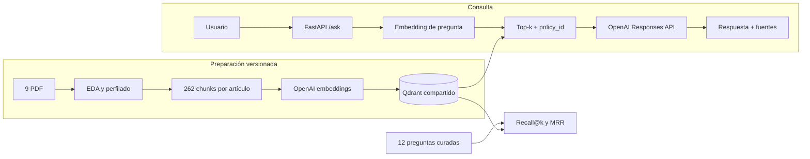

# Arquitectura del chatbot de pólizas

## Flujo esencial



## Componentes

### Carlos — API

- Contrato estable `answer`, `sources`, `metadata`.
- `/health` comprueba liveness y `/ready` dependencias reales.
- `/config` no expone secretos.
- Errores de validación, índice, conexión, cuota y timeout diferenciados.

### David — RAG

- Embeddings de pregunta con `text-embedding-3-small`.
- Qdrant top-k con filtro opcional `policy_id`.
- Generación fundamentada con `gpt-4.1-mini`.
- Citas por archivo, página y artículo.
- Abstención cuando no se recupera evidencia.

### Javier — datos y evaluación

- Chunking canónico por artículo con fallback por documento.
- 262 IDs deterministas y payload validado.
- Índice compartido con `embedding_model` e `index_version`.
- Migración `metadata-only` con cero llamadas a OpenAI.
- Dataset curado de 12 preguntas.
- Evaluación local y evaluación real con Hit Rate@k, Recall@k y MRR.

## Una sola fuente de verdad

La implementación vive en `insurance_chatbot.indexing`. Los scripts
`chunk_policies.py` e `index_chunks.py` son únicamente interfaces CLI
compatibles; ya no mantienen algoritmos independientes.

El índice se considera vigente cuando coinciden:

```text
chunk_id + embedding_model + index_version
```

Versión actual:

```text
article-v1-1024-154
```

Si todo coincide, la reindexación reutiliza los vectores. Si algo cambia,
primero obtiene todos los embeddings nuevos y después reemplaza la colección.

## Estado verificable

| Componente | Estado | Evidencia |
|---|---|---|
| EDA y perfilado | Hecho | `eda.py`, `profile_dataset.py` |
| FastAPI | Hecho | `app.py`, `schemas.py` |
| Chunking | Hecho | `indexing.py`, `chunk_policies.py` |
| Qdrant compartido | Hecho | 262 puntos, dimensión 1536 |
| Retrieval y RAG | Hecho | `rag_service.py` |
| Evaluación | Hecho | `evaluate_retrieval.py`, `retrieval_questions.json` |
| Frontend | Pendiente | responsabilidad de Nicolás |

## Seguridad y operación

- `.env` nunca se versiona.
- No se ejecutan dos procesos contra el mismo Qdrant embebido.
- El snapshot Qdrant evita regenerar embeddings, pero contiene texto del corpus.
- Mantener el repositorio privado hasta confirmar permiso de redistribución.
- Las respuestas contractuales conservan fuentes y requieren revisión humana.
