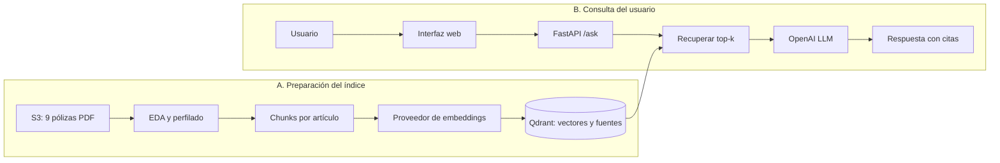

# Arquitectura del chatbot de pólizas

## Alcance y términos

El sistema tiene solo dos flujos principales:

1. **Preparación del índice (offline/batch):** se ejecuta cuando cambian los PDFs.
2. **Consulta (online/request):** se ejecuta cada vez que el usuario hace una pregunta.

Aquí **offline no significa “sin Internet”**. Significa un proceso previo y no interactivo.
El prototipo principal usará la API de OpenAI; el embedder local de hashing se conservará
únicamente como baseline de recuperación.

## Diagrama esencial



## Qué ocurre en cada flujo

### A. Preparación del índice

```text
PDF -> validación -> artículos -> chunks -> embeddings -> Qdrant
```

- `eda.py` descarga y audita los documentos.
- `profile_dataset.py` mide artículos, duplicados y tamaños candidatos.
- El chunker conservará `policy_id`, archivo, artículo, página y hash.
- OpenAI será el proveedor principal de embeddings.
- El hashing local servirá para comparar una línea base sin costo de API.
- Qdrant almacenará el vector, el texto y la fuente de cada chunk.

Esta ruta debe ser idempotente: un PDF sin cambios no se vuelve a indexar.

### B. Consulta

```text
Pregunta -> /ask -> embedding -> Qdrant -> top-k -> LLM -> respuesta citada
```

1. La interfaz envía una pregunta a `POST /ask`.
2. El backend genera el embedding de la pregunta.
3. Qdrant devuelve los chunks más relevantes.
4. El LLM recibe solo la pregunta y los chunks recuperados.
5. La API devuelve respuesta, fuentes y metadatos.
6. Si no hay evidencia suficiente, el sistema se abstiene.

## Contrato que no debe romperse

La UI, el retrieval y el modelo pueden desarrollarse en paralelo mientras `/ask` conserve:

```json
{
  "answer": "Respuesta fundamentada",
  "sources": ["POL320190074.pdf - Artículo 12 - Página 20"],
  "metadata": {
    "model": "modelo activo",
    "embedding_model": "embedder activo",
    "response_time_ms": 125.4
  }
}
```

## Estado real con evidencia

| Componente | Estado | Evidencia |
|---|---|---|
| Descarga S3 y EDA | Hecho | `src/insurance_chatbot/eda.py` |
| Perfilado y split | Hecho | `scripts/profile_dataset.py` y 3 tests |
| Contratos `/ask` y `/config` | Parcial | `app.py` y `schemas.py`; `/ask` aún responde datos simulados |
| Embedder local de hashing | En rama | `feature/david-online-retrieval`; todavía no está en `main` |
| Chunker que produzca chunks | Pendiente | solo existe la propuesta estadística |
| Qdrant e indexación | Pendiente | no existe implementación |
| Retrieval real | Pendiente | no está conectado a `/ask` |
| OpenAI embeddings y LLM | Pendiente | variables definidas, integración inexistente |
| Interfaz web | Pendiente | no existe código frontend |
| Noticias de Internet | Fase posterior | fuera del camino crítico del MVP |
| Generación de pólizas | Opcional | implementar después del RAG consultivo |

## Decisión de chunking basada en el corpus real

El perfilado de los 9 PDFs produjo:

- 267 páginas y 81.698 palabras.
- 241 artículos detectados.
- 0 PDFs escaneados y 0 errores de extracción.
- 1 par casi duplicado, que debe permanecer en el mismo split.
- Split propuesto: 7 documentos de desarrollo y 2 de evaluación.
- Longitud de artículos: p50 = 279, p75 = 651 y p90 = 1.335 tokens.

Decisión inicial:

```text
Unidad primaria: artículo
Tamaño máximo: 1.024 tokens
Solapamiento para artículos largos: 154 tokens (15 %)
```

Un tamaño de 1.024 cubre el 87,55 % de los artículos completos. Por eso los artículos
que superen ese límite se dividirán; no se asumirá que todos caben en un solo chunk.
La decisión se validará con Recall@k y MRR antes de declararla definitiva.

## Decisiones mínimas para el MVP

| Tema | Decisión |
|---|---|
| Backend | FastAPI |
| Contrato principal | `POST /ask` |
| Orquestación RAG | Haystack |
| Embeddings principales | OpenAI API |
| Baseline local | `LocalHashingEmbedder` |
| Base vectorial | Qdrant local mediante Docker |
| Generación | LLM mediante OpenAI API |
| Frontend | Cliente web que consuma `/ask` |
| Router LangChain | Agregar cuando exista la herramienta web; no es necesario para el primer RAG |

## Plan de implementación

1. **Indexación:** chunker, interfaz de embeddings, Qdrant y prueba de reindexación.
2. **Retrieval:** top-k, filtros por póliza y evaluación con preguntas revisadas.
3. **RAG real:** reemplazar la respuesta simulada de `/ask` por retrieval + OpenAI.
4. **Frontend:** historial, fuentes, modo de carga y estado del backend.
5. **Calidad:** citas obligatorias, abstención, latencia, costos y pruebas adversariales.
6. **Extensiones:** noticias web y generación de borradores de pólizas.

## Reglas de seguridad y calidad

- Los secretos viven únicamente en `.env`.
- Los PDFs y resultados generados no se versionan.
- Ninguna afirmación contractual se responde sin una fuente recuperada.
- El texto de los PDFs se trata como entrada no confiable.
- Un borrador de póliza siempre requiere revisión humana.
- No se integra una rama si rompe el contrato `/ask` o las pruebas.
