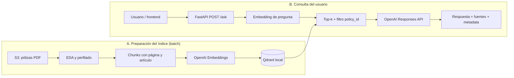

# Arquitectura del chatbot de pólizas

## Diagrama esencial



“Batch” significa preparación previa, no funcionamiento sin Internet. OpenAI
participa tanto en la indexación (embeddings de documentos) como en cada
consulta (embedding de pregunta y generación de respuesta).

## Responsabilidad de Carlos: API

- `POST /ask` conserva el contrato `answer`, `sources`, `metadata`.
- `GET /config` muestra los modelos, Qdrant, colección, top-k y si la clave existe,
  pero nunca expone el secreto.
- `GET /health` es liveness: confirma que FastAPI responde.
- `GET /ready` es readiness: exige clave configurada e índice no vacío.
- El servicio RAG y los clientes se reutilizan; no se abren por petición.
- Los errores de validación, índice, timeout, conexión y cuota se traducen a
  códigos HTTP diferenciados sin filtrar mensajes sensibles.

## Responsabilidad de David: indexación y RAG

```text
PDF -> extracción -> chunks -> embeddings -> Qdrant
Pregunta -> embedding -> Qdrant top-k -> contexto -> LLM -> respuesta citada
```

- La indexación usa IDs deterministas, omite documentos cuyo hash, modelo y
  versión de índice no cambiaron, y reemplaza los chunks anteriores solo
  después de haber obtenido todos los embeddings nuevos.
- Cada payload conserva texto, `policy_id`, archivo, página, artículo, hash y
  `chunk_id`.
- El retrieval permite filtrar por `policy_id` y configurar un umbral de score.
- Si Qdrant no existe o está vacío, se devuelve un error operativo explícito.
- Si no se recuperan chunks sobre el umbral, el RAG se abstiene y no llama al LLM.
- El prompt obliga a responder únicamente desde el contexto y citar `[Fuente N]`.

## Configuración

| Variable | Uso | Valor por defecto |
|---|---|---|
| `OPENAI_API_KEY` | Autenticación server-side | requerida |
| `OPENAI_CHAT_MODEL` | Generación | `gpt-4.1-mini` |
| `OPENAI_EMBEDDING_MODEL` | Embeddings | `text-embedding-3-small` |
| `QDRANT_PATH` | Índice persistente | `data/index/qdrant` |
| `QDRANT_COLLECTION` | Colección | `queplan_policies` |
| `RAG_TOP_K` | Máximo de chunks | `5` |
| `RAG_SCORE_THRESHOLD` | Score mínimo | vacío hasta evaluación |

No se fija un umbral arbitrario: Javier debe proponerlo con métricas de
retrieval. La implementación ya acepta la variable cuando exista esa evidencia.

## Estado verificable

| Componente | Estado | Evidencia |
|---|---|---|
| Descarga, EDA y perfilado | Hecho | `eda.py`, `profile_dataset.py` |
| Contratos y manejo de errores API | Hecho | `app.py`, `schemas.py` |
| Liveness/readiness/config | Hecho | `/health`, `/ready`, `/config` |
| Chunking para indexación | Hecho | `indexing.py` |
| Persistencia e idempotencia Qdrant | Hecho | `index_policies()` |
| Retrieval y filtro por póliza | Hecho | `RealRetrievalService` |
| Generación fundamentada | Hecho | `RealRAGService` |
| Índice local poblado | Bloqueado por entorno | OpenAI respondió `insufficient_quota` |
| Frontend | Fuera de este cambio | asignado a Nicolás |
| Evaluación Recall@k/MRR | Fuera de este cambio | asignado a Javier |

## Reglas de operación

- `.env`, PDFs, índices y resultados generados no se versionan.
- No levantar dos procesos contra el mismo Qdrant embebido.
- Reindexar después de cambiar PDFs o el modelo de embeddings.
- Una respuesta contractual siempre debe conservar fuentes.
- Los borradores de póliza requieren revisión humana.
