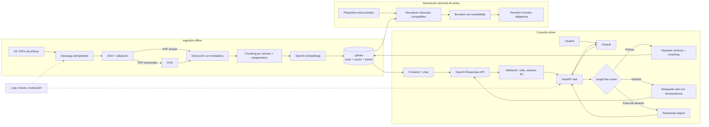

# Arquitectura esencial

## Decisión de diseño

El sistema separa dos rutas: una ingestión offline, determinista y repetible; y una consulta online de baja latencia. Haystack compone la extracción, segmentación, embeddings y recuperación RAG. LangChain se limita al agente que decide entre consultar pólizas, buscar noticias o rechazar una pregunta fuera de alcance. FastAPI expone el contrato HTTP y Chainlit consume ese mismo contrato para evitar duplicar la lógica de negocio.

## Responsabilidades y contratos

| Componente | Responsabilidad | Contrato mínimo |
|---|---|---|
| Descarga/EDA | Inventariar y auditar la fuente sin modificarla | hashes, métricas, errores y reportes reproducibles |
| Preprocesamiento Haystack | Extraer, limpiar y segmentar preservando estructura | `policy_id`, archivo, página, artículo, hash y versión |
| Qdrant | Persistir vectores y metadatos filtrables | colección versionada por modelo y estrategia de chunking |
| Recuperación | Búsqueda híbrida, filtros y reranking | top-k con puntajes y fuentes; nunca texto sin procedencia |
| Router LangChain | Elegir una herramienta permitida | `policies`, `news` o `out_of_scope` con salida estructurada |
| Generación | Responder solo con evidencia suficiente | afirmaciones enlazadas a citas; abstención si falta evidencia |
| FastAPI/Chainlit | API estable y experiencia conversacional | sesión, streaming, fuentes, errores y feedback |

## Estrategia de chunking

La unidad primaria será el artículo o cláusula, no una ventana arbitraria. Los artículos extensos se subdividen por párrafo con solapamiento moderado; títulos y definiciones se propagan como contexto. Cada chunk conserva `policy_id`, página inicial/final, artículo, título, hash del documento y versión de ingestión. Antes de adoptar esta estrategia se compara con chunks fijos mediante Recall@k, MRR y nDCG sobre preguntas revisadas manualmente.

## Robustez y seguridad

- Secretos únicamente en variables de entorno; `.env` está ignorado y `.env.example` no contiene valores.
- Los PDFs originales son inmutables y cada etapa registra hashes para detectar cambios.
- OCR, extracción y embeddings son reintentables e idempotentes; los fallos se aíslan en vez de desaparecer.
- El texto recuperado se trata como datos no confiables frente a prompt injection.
- La búsqueda web requiere fecha y URL; no se mezcla silenciosamente con contenido contractual.
- Una respuesta sin evidencia suficiente se abstiene. El sistema no ofrece asesoría legal ni aprueba pólizas.
- Todo borrador nuevo incluye la procedencia de sus cláusulas y exige revisión humana.

## Evaluación antes del demo

1. Construir preguntas por póliza, comparación, exclusiones y preguntas imposibles.
2. Medir recuperación (Recall@k, MRR, nDCG), fidelidad de citas y tasa de abstención correcta.
3. Probar PDFs corruptos, escaneados, duplicados, consultas multilingües y prompt injection.
4. Registrar latencia p50/p95, tokens y costo por pregunta.
5. Bloquear el release si la respuesta inventa cobertura, confunde fuentes o expone PII.

## Referencias técnicas

- [Haystack: componentes, pipelines, document stores, agents y tools](https://docs.haystack.deepset.ai/docs/intro)
- [LangChain: agent harness, tools, middleware y salida estructurada](https://docs.langchain.com/oss/python/langchain/overview)
- [OpenAI embeddings](https://developers.openai.com/api/docs/guides/embeddings)
- [Chainlit overview](https://docs.chainlit.io/overview)
- [Azure Search + OpenAI demo](https://github.com/Azure-Samples/azure-search-openai-demo)
