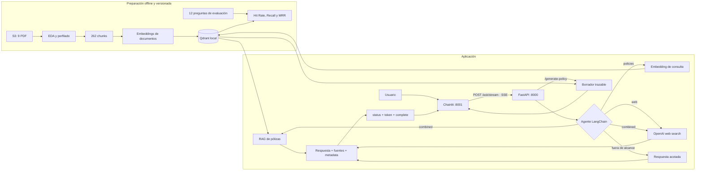

# Arquitectura del asistente de pólizas

## Vista completa



## Decisiones esenciales

1. **El corpus y el índice son locales.** Los documentos se procesan una vez; el
   snapshot Qdrant evita regenerar embeddings.
2. **La consulta no es completamente offline.** El índice es local, pero el
   embedding de la pregunta y la generación usan OpenAI.
3. **El router es un agente LangChain con herramientas de retorno directo.**
   En `auto` elige una sola herramienta; los modos explícitos son deterministas.
4. **Pólizas y web no se mezclan silenciosamente.** `combined` presenta dos
   secciones para distinguir contrato de información reciente.
5. **La web conserva sus URL.** Las fuentes se extraen de las anotaciones
   `url_citation` y de las acciones de web search.
6. **Los borradores no son documentos finales.** Solo recombinan evidencia y
   siempre exigen revisión humana especializada.
7. **La conversación usa SSE.** FastAPI envía estados periódicos y luego
   fragmentos de la respuesta; Chainlit los renderiza progresivamente.

## Componentes

| Componente | Responsabilidad | Implementación |
|---|---|---|
| EDA | calidad, duplicados, extracción y artículos | `eda.py`, `profile_dataset.py` |
| Indexación | chunking, embeddings e índice versionado | `indexing.py` |
| Retrieval | embedding de consulta, filtro y top-k | `RealRetrievalService` |
| RAG | respuesta limitada al contexto y citas | `RealRAGService` |
| Web | búsqueda reciente y URL citables | `OpenAIWebSearchService` |
| Agente | selección de herramienta y fallback | `AgenticRAGService` |
| Generación | borrador desde 1–3 pólizas | `PolicyDraftService` |
| API | contratos, readiness y errores seguros | `app.py`, `schemas.py` |
| UI | chips, sesión, modos, streaming, fuentes y comandos | `frontend/` |
| Operación | dos contenedores y healthchecks | `compose.yaml` |

## Flujo de consulta

1. Chainlit envía `question`, `policy_id` opcional y `mode`.
2. En `auto`, el agente llama exactamente una herramienta.
3. `policies` consulta Qdrant y genera solo con los chunks recuperados.
4. `web` usa la herramienta alojada de OpenAI para información actual.
5. `combined` ejecuta ambas rutas y conserva separadas sus evidencias.
6. FastAPI conserva el contrato JSON de `/ask`; `/ask/stream` lo transporta
   como eventos SSE `status`, `token`, `complete` o `error`.
7. Chainlit muestra progreso, anima la espera y agrega fuentes y metadatos al
   terminar. Si la pregunta contiene un ID `POL...`, lo usa como filtro solo
   para esa consulta.

Si LangChain no puede enrutar por timeout o error transitorio, un fallback
determinista selecciona la ruta mediante intención y vocabulario del dominio.

## Indexación reproducible

La versión actual es `article-v1-1024-154`. Un índice se reutiliza cuando
coinciden:

```text
chunk_id + embedding_model + index_version
```

Por eso una ejecución normal sobre el snapshot devuelve 262 chunks reutilizados,
0 chunks indexados y 0 batches de embeddings.

## Despliegue

`compose.yaml` levanta:

- `api`: FastAPI, OpenAI, LangChain y Qdrant embebido.
- `frontend`: Chainlit conectado internamente a `http://api:8000`.

Solo `api` recibe `OPENAI_API_KEY`. `.dockerignore` impide copiar `.env`,
datos crudos, caches o resultados locales a las imágenes.

## Seguridad y límites

- `.env` nunca se versiona ni se incluye en Docker.
- Los errores 500 no exponen credenciales ni detalles internos.
- Qdrant embebido admite una sola instancia sobre la misma carpeta.
- Las respuestas contractuales muestran fuentes y no son asesoría legal.
- Las noticias pueden cambiar; se conservan URL para verificación.
- El repositorio debe seguir privado mientras el corpus no tenga permiso de
  redistribución confirmado.
